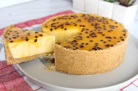

<!DOCTYPE html>
<html lang="pt-BR">
<head>
    <meta charset="UTF-8">
    <meta name="viewport" content="width=device-width, initial-scale=1.0">
    <title>Catálogo H&H Doces</title>
    <link href="https://fonts.googleapis.com/css2?family=Playfair+Display:wght@400;700&display=swap" rel="stylesheet">
    
</head>
<body>
    <header>
        <h1>Catálogo</h1>
        
H&H DOCES

        
🍰

    </header>

    

        
        

            <h2>Morango do Amor</h2>
            
Morango envolvido em brigadeiro branco e caramelo caseiro. (10g)

            
R$15

        

    

    

        
        

            <h2>Pudim de leite condensado</h2>
            
Pudim feito com leite condensado e calda de caramelo. (..G)

            
R$..

        

    

    

        
        

            <h2>Torta de limão</h2>
            
Torta de limão com chantilly e raspinhas de limão. (..G)

            
R$..

        

    

    

        
        

            <h2>Torta de maracujá</h2>
            
Torta de maracujá com cobertura de maracujá. (..G)

            
R$..

        

    

</body>
</html>
